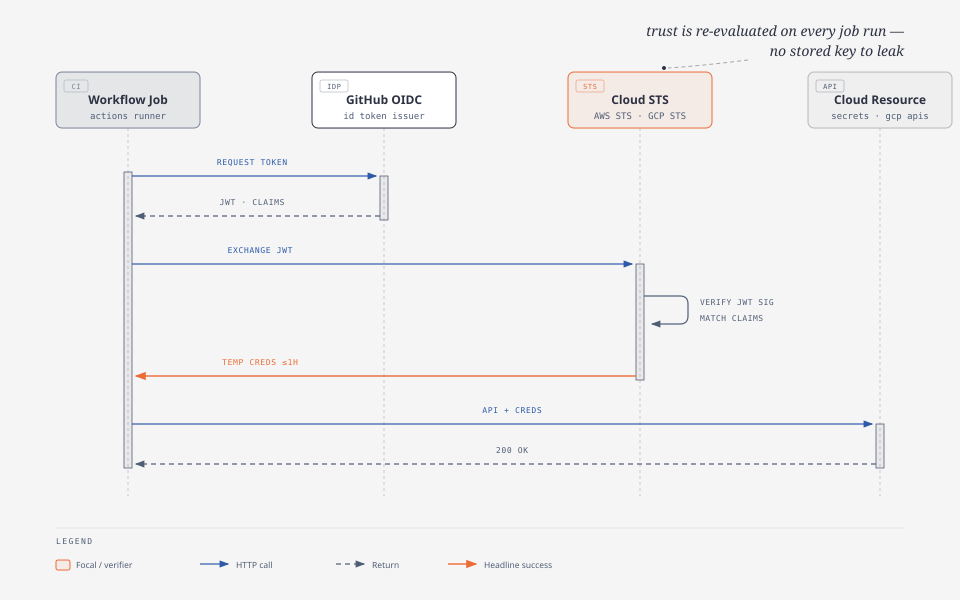
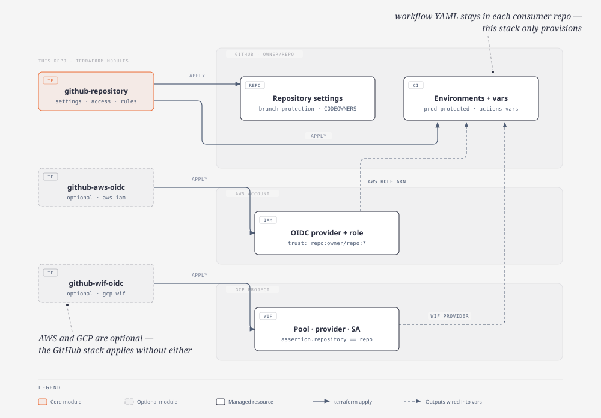
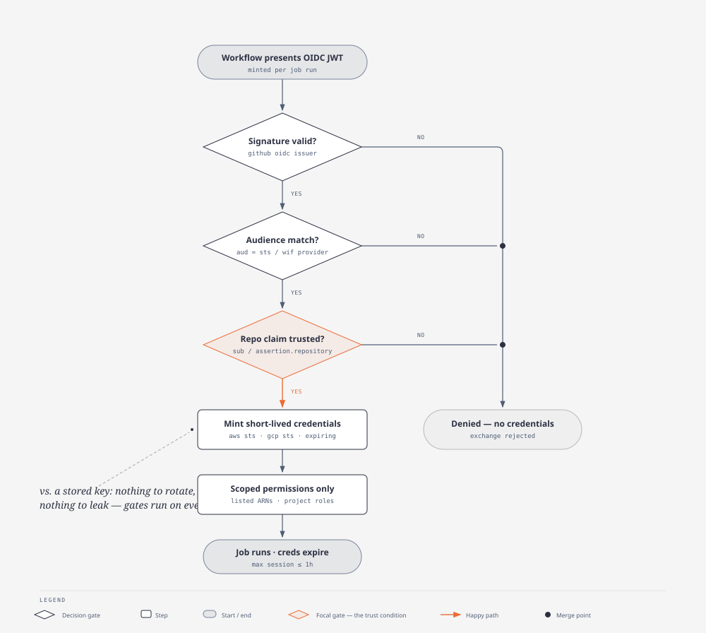

# github-repokit

[](https://github.com/emrecavunt/github-repokit/actions/workflows/ci.yml)
[](https://github.com/emrecavunt/github-repokit/actions/workflows/codeql.yml)
[](https://github.com/emrecavunt/github-repokit/releases)
[](LICENSE)

GitHub repository settings do not belong in the org console, and they do not
belong in a platform team's memory. They belong in the product repo, versioned
next to the code they protect.

These Terraform modules manage **one** repository: settings, team and
collaborator access, branch protection, CODEOWNERS, and Actions environments.
Optional AWS or GCP OIDC identity can be added when workflows need keyless
cloud access. Neither cloud is required to bootstrap GitHub Actions.

Clone it, point Terragrunt at a module, and each product repo owns its GitHub
configuration the same way it owns its application code.

This library does **not** write workflow YAML and does **not** manage the
GitHub organization. Workflows stay in `.github/workflows/` of each consumer.
Org-level teams, rulesets, membership, billing, and SSO belong in a separate
org stack.

## Modules

- **`modules/github-repository`**: one repo's settings, team and user access,
  branch protection (signed commits, reviews, required checks), CODEOWNERS,
  GitHub environments, and Actions variables (per-environment or repo-scoped)
- **`modules/github-aws-oidc`**: optional AWS IAM OIDC role for GitHub
  Actions. Assume-role trust is scoped to owner/repo, with Secrets Manager
  and SSM read on the ARNs you pass
- **`modules/github-wif-oidc`**: optional GCP Workload Identity Federation.
  Creates a Terraform apply service account, project IAM, and an optional
  project-local WIF pool and provider
- **`examples/repository-consumer`**: a copy-ready Terragrunt split.
  `github/repository` and `github/actions` come first (no cloud), then
  optional `aws/identity` or `gcp/identity` if workflows need that provider
- **`bootstrap/github`**: this repository managing itself with the same module

`make` lists every target. `make check` is what CI runs: Terraform `fmt` and
`validate`, TFLint, and Trivy when those tools are installed. Pushes to
`main` cut a semver tag via `semantic-release`. Pin consumers to a published
tag (`?ref=v1.0.0`), not `main`.

## How it works

Diagrams live in [`docs/diagrams/`](docs/diagrams/) as self-contained HTML
with SVG exports. Click through for the full-size interactive versions.

**The OIDC token exchange.** A workflow job trades a per-run GitHub JWT for
short-lived cloud credentials. The job does not need a stored cloud key:

[](docs/diagrams/oidc-token-exchange.html)

**What the modules apply.** `github-repository` owns settings and Actions
environments inside GitHub. The optional identity modules create the AWS role
and GCP WIF resources whose outputs feed Actions variables:

[](docs/diagrams/repo-architecture.html)

**The trust gates.** Every credential exchange must pass the issuer signature,
audience, and repository-claim checks before scoped, expiring credentials
are minted:

[](docs/diagrams/security-gates.html)

## Quickstart

Requires [Terraform](https://developer.hashicorp.com/terraform/install) `>= 1.7`
and [Terragrunt](https://terragrunt.gruntwork.io/). A `GITHUB_TOKEN` with
`repo` and `admin:org` (for team assignments) is enough for the GitHub
module. AWS or GCP credentials are needed only when you apply an identity
stack.

```bash
git clone https://github.com/emrecavunt/github-repokit.git
cd github-repokit
make check
```

`make` (or `make help`) lists every target. The ones you'll reach for:

| Target           | What it does                                          |
| ---------------- | ----------------------------------------------------- |
| `make check`     | Format, validate, lint, and Trivy (what CI runs)      |
| `make fmt`       | `terraform fmt` and `terragrunt hcl format`           |
| `make validate`  | Validate each module and the `bootstrap/` stack       |
| `make tg-plan`   | Plan the self-bootstrap stack                         |
| `make apply`     | Apply the self-bootstrap stack                        |

## Per-repository usage

Each product or service repo keeps a small Terragrunt stack under
`bootstrap/github`, split the same way this repo splits its own:

- **`bootstrap/github/repository`**: settings, teams, branch protection,
  CODEOWNERS (`manage_repository_settings = true`)
- **`bootstrap/github/actions`**: environments and Actions variables
  (`manage_repository_settings = false`). AWS and GCP are optional; the
  stack applies without either.

Both source this module by tag. Repository stack:

```hcl
terraform {
  source = "git::https://github.com/emrecavunt/github-repokit.git//modules/github-repository?ref=v1.0.0"
}

inputs = {
  repo_name   = "my-service"
  description = "Example service"
  visibility  = "private"

  users = {
    maintainer = {
      username   = "your-github-username"
      permission = "admin"
    }
  }

  teams = {
    platform = {
      slug       = "platform-engineers"
      permission = "push"
    }
  }

  branch_protection_rules = {
    main = {
      pattern                         = "main"
      require_signed_commits          = true
      require_code_owner_reviews      = true
      required_approving_review_count = 1
      required_status_checks          = true
      required_status_check_contexts  = ["verify"]
    }
  }

  codeowners = {
    "*" = ["@your-org/platform-engineers"]
  }

  write_repository_actions_variables = false
  manage_repository_settings         = true
  delete_branch_on_merge             = true
}
```

The actions stack (`bootstrap/github/actions`) uses the same module for
environments only:

```hcl
inputs = {
  repo_name = "my-service"

  manage_repository_settings         = false
  write_repository_actions_variables = false

  github_environment_configs = {
    dev = {
      variables = {}
    }
    prod = {
      protected           = true
      can_admins_bypass   = false
      prevent_self_review = true
      variables           = {}
    }
  }
}
```

When `manage_repository_settings = true` and the GitHub repo already exists,
the module imports `github_repository.settings[0]` on first apply
(`import_existing_repository = true`, the default). Set that input to `false`
only when this stack should create a new repository.

The older environment inputs still work:

- `github_environments` plus `github_actions_variables` (the same variables
  for every environment)
- `github_environment_configs` overrides those values for matching
  environment names

## Optional cloud identity (AWS or GCP)

Identity stacks are add-ons. Apply `bootstrap/github/actions` without them.
When a workflow needs keyless access, add `bootstrap/<provider>/identity`
and pass the outputs into Actions variables (`AWS_ROLE_ARN`,
`GCP_WORKLOAD_IDENTITY_PROVIDER`, and so on). A new provider follows the same
shape.

### AWS OIDC

```hcl
terraform {
  source = "git::https://github.com/emrecavunt/github-repokit.git//modules/github-aws-oidc?ref=v1.0.0"
}

inputs = {
  role_name            = "github-actions-secrets"
  github_owner         = "your-org"
  github_repositories  = ["your-org/my-service"]
  create_oidc_provider = true

  secretsmanager_secret_arns = [
    "arn:aws:secretsmanager:eu-west-1:111111111111:secret:app/dev/*",
  ]
}
```

Set `create_oidc_provider = false` and `oidc_provider_arn` to reuse an
account-level GitHub OIDC provider. Pass `role_arn` to the actions stack
as `AWS_ROLE_ARN`. This repo does not write the workflow that calls
`aws-actions/configure-aws-credentials`.

### GCP WIF

```hcl
terraform {
  source = "git::https://github.com/emrecavunt/github-repokit.git//modules/github-wif-oidc?ref=v1.0.0"
}

inputs = {
  service_account_project_id   = "my-service-dev"
  service_account_id           = "github-actions"
  service_account_display_name = "GitHub Actions"
  github_owner                 = "your-org"
  github_repositories          = ["your-org/my-service"]
  create_project_wif_provider  = true

  target_project_roles = {
    "my-service-dev" = [
      "roles/viewer",
    ]
  }
}
```

WIF mode:

- `create_project_wif_provider = false` (default): requires
  `workload_identity_pool_name` and `workload_identity_provider_name`
- `create_project_wif_provider = true`: creates the pool and provider in
  `service_account_project_id`

A walkthrough with optional AWS and GCP stacks lives in
[`examples/repository-consumer`](examples/repository-consumer/README.md).

## Remote state (optional)

Every Terragrunt root defaults to local state under `.terragrunt-state/`,
so nothing beyond a `GITHUB_TOKEN` is needed to start. When an AWS or GCP
project exists, store state remotely instead. Set the backend env vars
before `make tg-plan` / `make apply`:

```bash
# AWS: state in S3
export TG_STATE_BACKEND=s3
export TG_STATE_BUCKET=my-terraform-state   # must already exist

# GCP: state in GCS
export TG_STATE_BACKEND=gcs
export TG_STATE_BUCKET=my-terraform-state   # must already exist
```

| Variable                  | Meaning                                                              |
| ------------------------- | -------------------------------------------------------------------- |
| `TG_STATE_BACKEND`        | `local` (default), `s3`, or `gcs`                                    |
| `TG_STATE_BUCKET`         | Bucket name; required for `s3` and `gcs`                             |
| `TG_STATE_PREFIX`         | Object key prefix (defaults to a per-root path)                      |
| `TG_STATE_AWS_REGION`     | S3 bucket region (defaults to `AWS_REGION`, then `eu-west-1`)        |
| `TG_STATE_DYNAMODB_TABLE` | Optional DynamoDB table for S3 state locking                         |

S3 state is written with `encrypt = true`. The bucket is not created by
this repo. Create it once (with versioning enabled) in the account or
project that the identity stack targets.

## Self-bootstrap

This repository can manage its own GitHub settings:

```bash
export GITHUB_OWNER=emrecavunt
export GITHUB_TOKEN=...   # repo admin on emrecavunt/github-repokit

cd bootstrap/github
make tg-init
make tg-import-repo-settings REPO_NAME=github-repokit
make tg-plan
make apply
```

## Layout

```text
modules/github-repository/   # per-repo GitHub governance
modules/github-aws-oidc/     # optional AWS OIDC for Actions secrets
modules/github-wif-oidc/     # optional GCP OIDC / WIF
examples/repository-consumer/
  github/repository/         # settings, protection, CODEOWNERS
  github/actions/            # environments; no cloud required
  aws/identity/              # optional
  gcp/identity/              # optional
bootstrap/github/
  repository/                # this repo, managing itself
.github/workflows/           # ci, codeql, dependency-review, release
Makefile                     # the front-end: run `make`
```

## Versioning

Pushes to `main` run `semantic-release`. Conventional commits drive the bump:

| Commit                         | Version |
| ------------------------------ | ------- |
| `feat:`                        | minor   |
| `fix:`                         | patch   |
| `feat!:` or `BREAKING CHANGE:` | major   |

Pin consumers to a published tag (`?ref=v1.0.0`), not `main`.

## Security

See [SECURITY.md](SECURITY.md). Report privately, pin module versions, prefer
OIDC or WIF over stored cloud keys, and keep production GitHub environments
`protected = true`.

## License

[MIT](LICENSE) © Emre Cavunt
